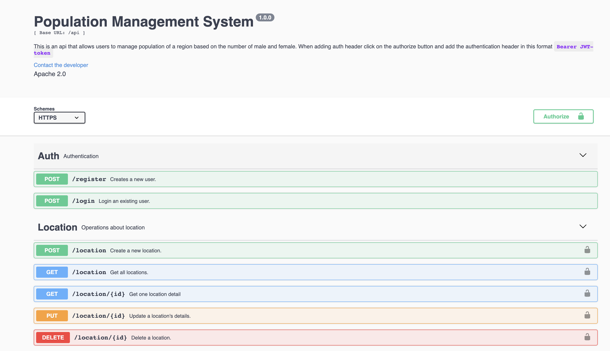

# Population Management
This application  contains a list of locations and the total number of residents in each location broken down by gender.

## Requirements
- Node
- Express
- MongoDB
- Mongoose ORM

## How to Test
- Clone the branch `git clone https://github.com/lukorito/pop-management-api.git`
- `cd pop-management-api`
- Run `yarn`
- create a `.env` file with details as specified in `env-example`
- Run `yarn start` to start the application

## Screenshot

